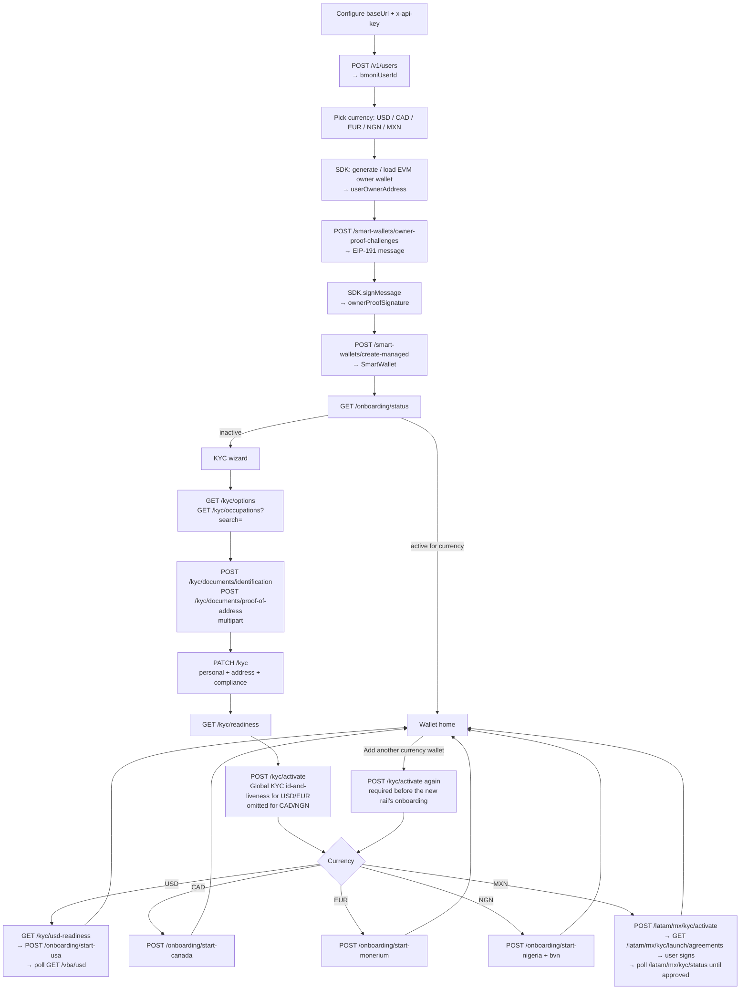
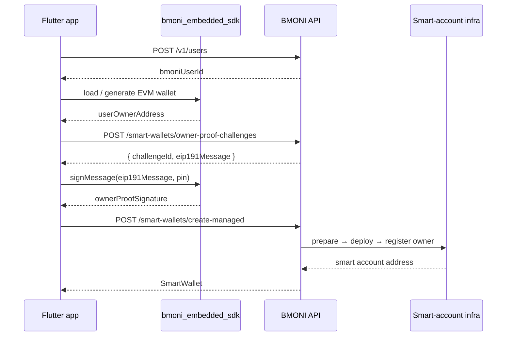
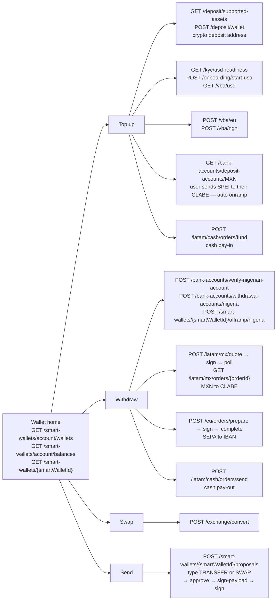

> ## Documentation Index
> Fetch the complete documentation index at: https://bkey.mintlify.site/llms.txt
> Use this file to discover all available pages before exploring further.

# Integration flow

> End-to-end map of the BMONI Embedded API — from creating a user, to provisioning a smart wallet, through KYC, to top-up / withdraw / swap.

<div className="bmoni-spine">
  <span>Lifecycle</span>
  <a data-stage="1" href="/lifecycle#1-create-the-user">User</a>
  <a data-stage="2" href="/lifecycle#2-provision-the-smart-wallet">Wallet</a>
  <a data-stage="3" href="/lifecycle#3-verify-identity-kyc">KYC</a>
  <a data-stage="4" href="/lifecycle#4-activate-the-rail">Rail</a>
  <a data-stage="5" href="/lifecycle#5-fund-the-wallet">Fund</a>
  <a data-stage="6" href="/lifecycle#6-move-money">Move money</a>
</div>

This page walks through the full integration order: which endpoints to call, in what sequence, and how on-device signing from [`bmoni_embedded_sdk`](/sdk/introduction) interlocks with the proxy. It mirrors the reference Flutter app shipped with the API (see `example/lib/main.dart` in the `bmoni-proxy-api` repo).

<Info>
  Every user-scoped endpoint takes the `bmoniUserId` returned from `POST /v1/users` as a path parameter. Persist this id (the example uses `shared_preferences`) so PIN unlock can re-enter without recreating the user.
</Info>

***

## Prerequisites

* A partner **API key** — pass it as `x-api-key: <key>` on every request.
* The **proxy base URL** — origin only, **no trailing `/v1`**. Path constants already start with `/v1/`; including it in the base URL produces `/v1/v1/...` → 404.
* [`bmoni_embedded_sdk`](/sdk/introduction) initialised on-device for owner-wallet generation and signing.

```dart theme={null}
// Correct
const baseUrl = 'https://embedded-dev.bmoni.com';

// Wrong — causes /v1/v1/... 404s
const baseUrl = 'https://embedded-dev.bmoni.com/v1';
```

***

## High-level flow



<Note>
  KYC data is submitted once and reused across currencies, but **activation is per-onboarding, not per-profile.** A user who already completed (for example) Nigeria onboarding and now wants to add a USD / CAD / EUR wallet must call `POST /kyc/activate` again **before** the new currency's `POST /onboarding/start-*`. The KYC wizard (uploads + `PATCH /kyc`) does **not** need to be repeated.
</Note>

***

## Step-by-step

<Steps>
  <Step title="Create the user">
    ```http theme={null}
    POST /v1/users
    x-api-key: <partner key>
    ```

    The response contains the `bmoniUserId` you will reuse for every subsequent call. Persist it locally — recreating the user on each launch will fork the wallet history.
  </Step>

  <Step title="Generate the on-device owner wallet">
    Use [`bmoni_embedded_sdk`](/sdk/wallet-provisioning) to produce (or load) the EVM keypair whose address will be registered as the smart wallet's owner.

    ```dart theme={null}
    final ownerAddress = await BmoniEmbeddedSdk.hasWallet()
        ? (await BmoniEmbeddedSdk.walletAddress())!
        : await BmoniEmbeddedSdk.initWallet();
    ```

    The private key never leaves the device's secure element — only `ownerAddress` and signatures are sent to the proxy.
  </Step>

  <Step title="Request the owner-proof challenge">
    ```http theme={null}
    POST /v1/users/{userId}/smart-wallets/owner-proof-challenges
    {
      "currency": "USDB",
      "userOwnerAddress": "0x…"
    }
    ```

    The response includes an EIP-191 message and a `challengeId`. The same key that produced `userOwnerAddress` must sign the message — otherwise `create-managed` rejects the request.
  </Step>

  <Step title="Sign the challenge and create the managed smart wallet">
    ```dart theme={null}
    final sig = await BmoniEmbeddedSdk.signMessage(challenge.message, pin: pin);
    ```

    ```http theme={null}
    POST /v1/users/{userId}/smart-wallets/create-managed
    {
      "currency": "USDB",
      "userOwnerAddress": "0x…",
      "ownerProofChallengeId": "…",
      "ownerProofSignature": "0x…"
    }
    ```

    The proxy performs prepare → deploy → owner-address registration server-side and returns the `SmartWallet` (address, chain, currency, status).

    <Note>
      Smart-wallet calls take the **stablecoin** currency, not the fiat code: `USDB` (USD), `CNGN` (NGN), `CADC` (CAD), `EURe` (EUR), `GBPe` (GBP), `MEXe` (MXN). Fetch the live list from `GET /v1/smart-wallets/supported-currencies`.
    </Note>
  </Step>

  <Step title="Check onboarding status">
    ```http theme={null}
    GET /v1/users/{userId}/onboarding/status
    ```

    If the chosen currency is already active, jump straight to the wallet home. Otherwise, enter the KYC wizard.
  </Step>

  <Step title="Run the KYC wizard">
    The submit order is **fixed** — do not reorder these calls:

    1. `GET /v1/users/{userId}/kyc/options` — option lists for personal / address / employment fields.
    2. `GET /v1/users/{userId}/kyc/occupations?search=…` — autocompleted occupation list.
    3. `POST /v1/users/{userId}/kyc/documents/identification` — `multipart/form-data` with the ID image plus `type`, `documentNumber`, `issuingCountry`, optional `expirationDate` / `issueDate`.
    4. `POST /v1/users/{userId}/kyc/documents/proof-of-address` — `multipart/form-data` with the proof image plus `type`.
    5. `POST /v1/users/{userId}/kyc/documents/biometric` — `multipart/form-data` with the selfie. Required on the Global KYC path (USD / EUR / MXN); not needed for CAD / NGN.
    6. `PATCH /v1/users/{userId}/kyc` — personal + address + employment + compliance (`bvn` for NGN — in sandbox, use the test BVN `22222222222`).
    7. `GET /v1/users/{userId}/kyc/readiness` — gate before activation.
    8. `POST /v1/users/{userId}/kyc/activate` — passes a `sumsubLevelName` (e.g. `"id-and-liveness"`) for USD / EUR; omit the body for CAD / NGN.

    Currency-specific field requirements live in [KYC — USD](/api-reference/kyc-usd-requirements), [KYC — NGA](/api-reference/kyc-nga-requirements), [KYC — CAN](/api-reference/kyc-can-requirements), [KYC — EUR](/api-reference/kyc-eur-requirements), [KYC — MEX](/api-reference/kyc-mex-requirements), and [KYC — ROW](/api-reference/kyc-row-requirements).
  </Step>

  <Step title="Start the rail-specific onboarding">
    One call per currency, with the smart wallet's on-chain address (and `bvn` for Nigeria):

    | Currency | Endpoint                                                                                                  |
    | -------- | --------------------------------------------------------------------------------------------------------- |
    | USD      | `POST /v1/users/{userId}/onboarding/start-usa`                                                            |
    | CAD      | `POST /v1/users/{userId}/onboarding/start-canada`                                                         |
    | EUR      | `POST /v1/users/{userId}/onboarding/start-monerium`                                                       |
    | NGN      | `POST /v1/users/{userId}/onboarding/start-nigeria`                                                        |
    | MXN      | `POST /v1/users/{userId}/latam/mx/kyc/activate` — see [KYC — Mexico](/api-reference/kyc-mex-requirements) |

    The body carries the currency-prefixed wallet fields — `cadWalletAddress` + `cadWalletIndex`, `eurWalletAddress` + `eurWalletIndex`, or (for Nigeria) `bvn` + `ngnWalletAddress` + `ngnWalletIndex`. MXN is the exception: `POST /latam/mx/kyc/activate` takes the Mexican paternal/maternal surnames, and approval additionally requires the user to sign Etherfuse's agreements via `GET /latam/mx/kyc/launch/agreements`. After this returns successfully, `GET /onboarding/status` will report the currency as active and the wallet home becomes available.

    <Note>
      **USD is slightly different.** Gate it on `GET /v1/users/{userId}/kyc/usd-readiness` (a USD-specific check, separate from `/kyc/readiness`), then call `POST /v1/users/{userId}/onboarding/start-usa` with `{ smartWalletId }` — it returns `{ workflowId }`. Track the resulting account with `GET /v1/users/{userId}/vba/usd` (`status` becomes `active` once issued). See [Wallet home operations](#wallet-home-operations).
    </Note>

    **Adding a wallet later:** if the user already onboarded one currency and now wants another, re-run `POST /kyc/activate` first (the submitted KYC data is reused — no need to repeat the wizard), then call this currency's `start-*` endpoint.
  </Step>
</Steps>

***

## Smart-wallet creation handshake



***

## Wallet home operations

Once a wallet is active, the home screen drives top-up, withdraw, and swap from these endpoints:



| Action                            | Endpoint                                                                                                                                                                         |
| --------------------------------- | -------------------------------------------------------------------------------------------------------------------------------------------------------------------------------- |
| List wallets                      | `GET /v1/users/{userId}/smart-wallets/account/wallets`                                                                                                                           |
| List balances                     | `GET /v1/users/{userId}/smart-wallets/account/balances`                                                                                                                          |
| Wallet detail                     | `GET /v1/users/{userId}/smart-wallets/{smartWalletId}`                                                                                                                           |
| Crypto top-up address             | `POST /v1/users/{userId}/deposit/wallet`                                                                                                                                         |
| USD virtual bank account          | `GET /v1/users/{userId}/kyc/usd-readiness` → `POST /v1/users/{userId}/onboarding/start-usa` → `GET /v1/users/{userId}/vba/usd`                                                   |
| Virtual bank accounts (EUR / NGN) | `POST /v1/users/{userId}/vba/eu`, `POST /v1/users/{userId}/vba/ngn`                                                                                                              |
| NGN bank withdrawal               | `POST /v1/users/{userId}/bank-accounts/verify-nigerian-account` → `…/withdrawal-accounts/nigeria` → `…/smart-wallets/{smartWalletId}/offramp/nigeria`                            |
| Swap / preview                    | `POST /v1/users/{userId}/exchange/convert`                                                                                                                                       |
| Send to another user              | `POST /v1/users/{userId}/smart-wallets/{smartWalletId}/proposals` → `…/proposals/{proposalId}/approve` → `…/sign-payload` → `…/sign` — see [Transfers](/api-reference/transfers) |
| Supported wallet currencies       | `GET /v1/smart-wallets/supported-currencies`                                                                                                                                     |
| Supported crypto deposit assets   | `GET /v1/deposit/supported-assets`                                                                                                                                               |

### Regional money movement

| Region                | Rail                                                                                                         | Reference                                      |
| --------------------- | ------------------------------------------------------------------------------------------------------------ | ---------------------------------------------- |
| Mexico                | MXN via SPEI/CLABE — deposit-driven onramp, offramp quotes (`/latam/mx/quote`, `/latam/mx/orders/{orderId}`) | [MXN on/offramp](/api-reference/mxn-ramp)      |
| LATAM (MX, CL, CO, …) | Cash pay-in / pay-out orders (`/latam/cash/orders/{fund,send}`)                                              | [LATAM cash orders](/api-reference/latam-cash) |
| Europe                | SEPA payouts to IBAN (`/eu/orders/prepare` → sign → `/eu/orders/complete`)                                   | [EU SEPA payouts](/api-reference/eu-sepa)      |

***

## Gotchas

* **Base URL is origin-only.** Strip any trailing `/v1` from copy-pasted values.
* **Owner-proof signature must match `userOwnerAddress`.** Reuse the same SDK instance for `initWallet` / `walletAddress` and `signMessage`.
* **KYC submit order is fixed.** Uploads → PATCH `/kyc` → `/readiness` → `/activate` → rail `start-*`. USD additionally gates `start-usa` on `GET /kyc/usd-readiness`, then tracks the account via `GET /vba/usd`. Skipping or reordering will return validation errors.
* **Global KYC activation is currency-specific.** USD and EUR require a `sumsubLevelName` (`id-only`, `id-and-liveness`, or `idv-and-phone-verification`); CAD and NGN must omit it.
* **Each additional currency needs its own activation.** Activation is per-onboarding, not per-profile — adding a wallet to an already-onboarded user means calling `POST /kyc/activate` again before the new rail's `start-*`. The KYC wizard itself is not repeated.
* **Persist `bmoniUserId`.** The reference example uses `shared_preferences` so PIN unlock returns the user to their existing wallet instead of provisioning a new one.

***

## Reference implementation

The full Flutter reference app (`example/lib/main.dart` in the `bmoni-proxy-api` repo) implements every endpoint above with concrete request/response shapes, multipart uploads, error handling, and session persistence. Use it as the source of truth for body shapes and edge-case handling.
